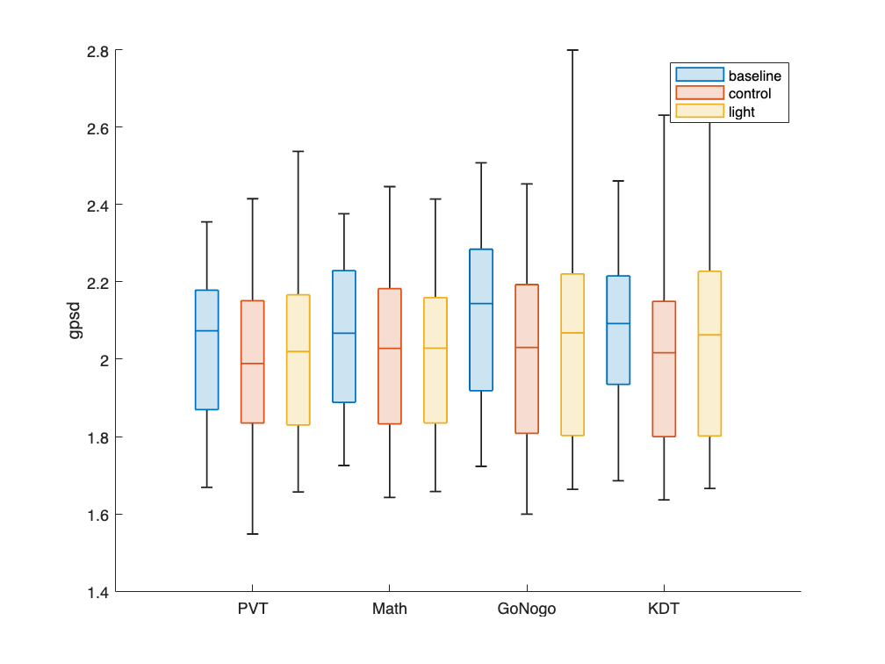

# Nested Analysis of clustering for first nasa presentation
## READ THIS TO UNDERSTAND WHAT THIS ANALYSIS WAS ABOUT
### What this was about


this was the analysis used to present to the nasa people on friday august 19th, the very first presentation. 

you can see the presenation 

all i did was run the analysis below with 3 different network properties and created the slides with them. you can recreate the figures by going through each section and changing the following variable to either 'clust', 'pathl', or 'gpsd....

The analysis is nicely structured because it analyzes variables in a 'nested' manner, first by comparing differences between conditions, averaging accross all other variables, then goes deeper and deeper averaging only accross tasks, then time, then bands, etc. however the slides were not organizes in this manner, since at the very end javi and kanika helped me reorganize the presentation to fit what cassie and erin may want to see.

Note that there is one slide that i did not create here. it was the slide where i assessed the lower and higher frequency bands for the math and pv task, and found differences in onset times and duration of clustering changes. That analysis was performed previously and will be pushed to git soon. 

```matlab:Code
desired_ntwprop = 'clust';
```

### Next things to do immediately


first

there were some issue with the analysis, or better stated, a subpar understanding of the analysis- namely the issue was that i didnt realize i was not averaging accross bands as i initially thought i was. the issue is in the building/cleaning dataframe function, which was able to average accross bands, but missed averaging accross the variable termed 'ordinal bands' or 'ordinal levels'. this prevented the bands from being averaged accross. the problem isnt that big visually, but it will impact the testing performed since it basically increased the number of samples within each comparison group. you can see the function below. so this was issue number one. 


second

another issue, one that i knew as i ran the analysis, is that i used independent samples ttests to compare accross tasks, which of course is an issue because some samples within each task had the same subjects (although they also had different subkects too). two solutions were discussed during the meeting - first is to use a fixed effects model and second is to show javi how i tossed some subjects from the analysis.


third

display the unique subjects/degrees of freedom for each test to emphasize the (in)dependence of the samples)


fourth


ask kanika about removing the KD task


fifth


ask kanika about what variables to 'average accross'


sixth


as always, there are more things to do that are in the backburner, see the very last section of this folder


  
  
# Generate Master Data Set


First retreive Master Data Set


```matlab:Code
DF = dfmaster;
```


```text:Output
Getting GPSD during PVT Task. . . . . . . . . . . . -done

Getting Network Props during PVT: . . . . . . . . . . . . -done

Getting GPSD during KDT Task. . . . . . . . . . . -done

Getting Network Props during KDT: . . . . . . . . . . . -done

Getting GPSD during MATH Task. . . . . . . . . . . . -done

Getting Network Props during MATH: . . . . . . . . . . . . -done

Getting GPSD during GONOGO Task. . . . . . . . . . . . -done

Getting Network Props during GONOGO: . . . . . . . . . . . . -done
```

  
# EFFECTS OF SLEEP INERTIA
# How does sleep inertia effect the network, averaging accross tasks, channels, bands and runs (COMPLETE!!!)


Initialize Constants


```matlab:Code
clearvars -except DF
desired_ntwprop = 'gpsd';
removeKdtFromDf = false;
```

## Build the clean and grouped data frame of network property 

```matlab:Code
averageAccrossVars = ["chan", "band", "run", "cogtest"];
df     = grpAndCleanDf(DF, desired_ntwprop, averageAccrossVars, removekdt = removeKdtFromDf);
```


```text:Output
All tasks included in this cleaned data frame/n
```

## Visualize

```matlab:Code
figure
boxchart(df.condition, df.mean_Y);
ylabel(desired_ntwprop)
```


## Initialize Testing functions and run tests

```matlab:Code
issig_str   = {'be SIMILAR', 'CHANGE'};
runtest     = @(df, ntw, cond_i, cond_j) ttest(df.mean_Y(df.ntwprop == ntw & df.condition == cond_i), df.mean_Y(df.ntwprop == ntw & df.condition == cond_j));
disptest    = @(ntw, cond_i, h, cond_j, p) fprintf('Network %s tends to %s during the %s vs the %s condition (p=%.03f)\n\n', upper(ntw), issig_str{h+1}, cond_i, cond_j,p);
```

## Run tests

```matlab:Code
condition_pairs = {'baseline', 'control';'baseline', 'light'; 'control', 'light' };
for i = 1:3
    ci = condition_pairs{i,1};
    cj = condition_pairs{i,2};
    [h,p] = runtest(df, desired_ntwprop, ci,cj);
disptest(desired_ntwprop, ci,h, cj,p);
end
```


```text:Output
Network GPSD tends to CHANGE during the baseline vs the control condition (p=0.000)

Network GPSD tends to be SIMILAR during the baseline vs the light condition (p=0.083)

Network GPSD tends to CHANGE during the control vs the light condition (p=0.014)
```

# How does the network change during sleep inertia, while performing a given task? Ignore the run and the frequency band (COMPLETE!!!)


Initialize Constants


```matlab:Code
clearvars -except DF
desired_ntwprop = 'gpsd';
removeKdtFromDf = false;
```

## Build the clean and grouped data frame of network property 

```matlab:Code
averageAccrossVars = ["chan", "band", "run"];
df = grpAndCleanDf(DF, desired_ntwprop, averageAccrossVars,removekdt = removeKdtFromDf);
```


```text:Output
All tasks included in this cleaned data frame/n
```

## Visualize 

```matlab:Code
figure;
boxchart(df.cogtest, df.mean_Y, "GroupByColor", df.condition);
% boxchart(df_cg.condition, df_cg.mean_Y, "GroupByColor", df_cg.cogtest);

ylabel(desired_ntwprop)
legend
```




## Test differences in clustering coeffients within the same task

```matlab:Code
    issig_str = {'be SIMILAR', '***CHANGE (significant!!!)***'};

    getrows = @(df,ntw, cogtask, condition) df.mean_Y(df.cogtest == cogtask & df.ntwprop == ntw & df.condition == condition);

    runtest  = @(df, ntw, cogtask, cond_i, cond_j)...
        ttest(getrows(df,ntw, cogtask, cond_i), getrows(df,ntw, cogtask, cond_j));
    
    disptest = @(cogtask, ntw, h, cond_i , cond_j,p)...
        fprintf('\tWhile engaging in %s, network %s tends to %s during the %s condition vs the %s condition (p=%.03f)\n\n',...
        cogtask, upper(ntw), issig_str{h+1}, cond_i, cond_j,p);

condition_pairs = {'baseline', 'control';'baseline', 'light'; 'control', 'light' };
cogtask_list = {'PVT', 'Math', 'GoNogo','KDT'};
for cogtaskidx = 1:4
    desired_cog_task = cogtask_list{cogtaskidx};
    fprintf('#### %s ###', desired_cog_task)
    for i = 1:3
        ci = condition_pairs{i,1};
        cj = condition_pairs{i,2};
        [h,p] = runtest(df, desired_ntwprop,desired_cog_task, ci,cj);
        disptest(desired_cog_task, desired_ntwprop, h, ci, cj,p);
    end

end
```


```text:Output
#### PVT ###
	While engaging in PVT, network GPSD tends to ***CHANGE (significant!!!)*** during the baseline condition vs the control condition (p=0.009)

	While engaging in PVT, network GPSD tends to be SIMILAR during the baseline condition vs the light condition (p=0.299)

	While engaging in PVT, network GPSD tends to ***CHANGE (significant!!!)*** during the control condition vs the light condition (p=0.008)
#### Math ###
	While engaging in Math, network GPSD tends to ***CHANGE (significant!!!)*** during the baseline condition vs the control condition (p=0.003)

	While engaging in Math, network GPSD tends to ***CHANGE (significant!!!)*** during the baseline condition vs the light condition (p=0.000)

	While engaging in Math, network GPSD tends to be SIMILAR during the control condition vs the light condition (p=0.409)
#### GoNogo ###
	While engaging in GoNogo, network GPSD tends to ***CHANGE (significant!!!)*** during the baseline condition vs the control condition (p=0.001)

	While engaging in GoNogo, network GPSD tends to be SIMILAR during the baseline condition vs the light condition (p=0.117)

	While engaging in GoNogo, network GPSD tends to be SIMILAR during the control condition vs the light condition (p=0.062)
#### KDT ###
	While engaging in KDT, network GPSD tends to be SIMILAR during the baseline condition vs the control condition (p=0.091)

	While engaging in KDT, network GPSD tends to be SIMILAR during the baseline condition vs the light condition (p=0.799)

	While engaging in KDT, network GPSD tends to be SIMILAR during the control condition vs the light condition (p=0.106)
```

# How does the network change during sleep inertia, while performing a given task, for each run 
## see temporal analysis below for this analysis
# EFFECTS OF TASK SWITCHING
# How does SWITCHING  tasks impact the network? Ignore the condition, run and the frequency band 


Initialize Constants


```matlab:Code
clearvars -except DF
desired_ntwprop = 'gpsd';
removeKdtFromDf = false;
```

### Build the data set

\hfill \break


```matlab:Code
averageAccrossVars = ["chan", "band", "run", "condition"];
df     = grpAndCleanDf(DF, desired_ntwprop, averageAccrossVars, removekdt = removeKdtFromDf);
```


```text:Output
All tasks included in this cleaned data frame/n
```

### Visualize

\hfill \break


```matlab:Code
figure
boxchart(df.cogtest, df.mean_Y);
ylabel(desired_ntwprop)
```


### Test Init

\hfill \break


```matlab:Code
runtest = @(taski, taskj) ttest2(df.mean_Y(df.cogtest ==taski), df.mean_Y(df.cogtest ==taskj));

issig_str = {'be SIMILAR', '***CHANGE (significant!!!)***'};
    
    disptest = @(ntw, h, taski, taskj, p)...
        fprintf('%s tends to %s when switching from %s to the %s task (p=%.03f)\n\n',...
        upper(ntw), issig_str{h+1}, taski, taskj,p);
```


Test


```matlab:Code
task_pair_list = {'PVT', 'Math';'PVT', 'GoNogo';'PVT', 'KDT';'Math', 'GoNogo';'Math', 'KDT';'GoNogo', 'KDT'};
for i =1:6
    [h,p] = runtest(task_pair_list{i,1}, task_pair_list{i,2});
    disptest(desired_ntwprop, h, task_pair_list{i,1}, task_pair_list{i,2}, p);
    
end
```


```text:Output
GPSD tends to be SIMILAR when switching from PVT to the Math task (p=0.971)

GPSD tends to be SIMILAR when switching from PVT to the GoNogo task (p=0.402)

GPSD tends to be SIMILAR when switching from PVT to the KDT task (p=0.474)

GPSD tends to be SIMILAR when switching from Math to the GoNogo task (p=0.402)

GPSD tends to be SIMILAR when switching from Math to the KDT task (p=0.472)

GPSD tends to be SIMILAR when switching from GoNogo to the KDT task (p=0.894)
```

# How does SWITCHING  tasks, within the same condition, impact the network? Ignore the run and the frequency band (COMPLETE!!!)


Initialize Constants


```matlab:Code
clearvars -except DF
desired_ntwprop = 'clust';
removeKdtFromDf = false;
```

### Build the clean and grouped data frame of network property 

\hfill \break


```matlab:Code
averageAccrossVars = ["chan", "band", "run"];
df = grpAndCleanDf(DF, desired_ntwprop, averageAccrossVars,removekdt = removeKdtFromDf);
```


```text:Output
All tasks included in this cleaned data frame/n
```

### Visualize

\hfill \break


```matlab:Code
figure;
boxchart(df.condition, df.mean_Y, "GroupByColor", df.cogtest);
ylabel(desired_ntwprop)
legend
```


## Test differences in clustering coeffients BETWEEN the three tasks

```matlab:Code
runtest = @(condition, taski, taskj) ttest2(df.mean_Y(df.cogtest ==taski & df.condition == condition), df.mean_Y(df.cogtest ==taskj &  df.condition == condition));

issig_str = {'be SIMILAR', '***CHANGE (significant!!!)***'};
    
    disptest = @(condition, ntw, h, taski, taskj, p)...
        fprintf('During the %s condition, %s tends to %s when switching from %s to the %s task (p=%.03f)\n\n',...
        condition, upper(ntw), issig_str{h+1}, taski, taskj,p);
```


Test


```matlab:Code
task_pair_list = {'PVT', 'Math';'PVT', 'GoNogo';'PVT', 'KDT';'Math', 'GoNogo';'Math', 'KDT';'GoNogo', 'KDT'};
condition_list = {'baseline', 'control', 'light'};

for cndidx = 1:3
    desired_condition = condition_list{cndidx};
    fprintf('### %s condition ###',desired_condition)
    for i =1:6
        taski = task_pair_list{i,1};
        taskj = task_pair_list{i,2};
        [h,p] = runtest(desired_condition, taski, taskj);
        disptest(desired_condition, desired_ntwprop, h, taski, taskj, p);
    
    end
end
```


```text:Output
### baseline condition ###
During the baseline condition, CLUST tends to be SIMILAR when switching from PVT to the Math task (p=0.202)

During the baseline condition, CLUST tends to ***CHANGE (significant!!!)*** when switching from PVT to the GoNogo task (p=0.011)

During the baseline condition, CLUST tends to be SIMILAR when switching from PVT to the KDT task (p=0.171)

During the baseline condition, CLUST tends to be SIMILAR when switching from Math to the GoNogo task (p=0.155)

During the baseline condition, CLUST tends to be SIMILAR when switching from Math to the KDT task (p=0.961)

During the baseline condition, CLUST tends to be SIMILAR when switching from GoNogo to the KDT task (p=0.149)
### control condition ###
During the control condition, CLUST tends to ***CHANGE (significant!!!)*** when switching from PVT to the Math task (p=0.036)

During the control condition, CLUST tends to ***CHANGE (significant!!!)*** when switching from PVT to the GoNogo task (p=0.002)

During the control condition, CLUST tends to ***CHANGE (significant!!!)*** when switching from PVT to the KDT task (p=0.005)

During the control condition, CLUST tends to be SIMILAR when switching from Math to the GoNogo task (p=0.165)

During the control condition, CLUST tends to be SIMILAR when switching from Math to the KDT task (p=0.296)

During the control condition, CLUST tends to be SIMILAR when switching from GoNogo to the KDT task (p=0.777)
### light condition ###
During the light condition, CLUST tends to ***CHANGE (significant!!!)*** when switching from PVT to the Math task (p=0.000)

During the light condition, CLUST tends to ***CHANGE (significant!!!)*** when switching from PVT to the GoNogo task (p=0.004)

During the light condition, CLUST tends to be SIMILAR when switching from PVT to the KDT task (p=0.084)

During the light condition, CLUST tends to be SIMILAR when switching from Math to the GoNogo task (p=0.571)

During the light condition, CLUST tends to be SIMILAR when switching from Math to the KDT task (p=0.071)

During the light condition, CLUST tends to be SIMILAR when switching from GoNogo to the KDT task (p=0.232)
```

# ON THE EFFECTS OF TIME
# How does the network change accross time? ignore, conditions, tasks, and bands (COMPLETE!!!)


Initialize Constants


```matlab:Code
clearvars -except DF
desired_ntwprop = 'clust';
removeKdtFromDf = false;
```

## Build the clean and grouped data frame of network property 

```matlab:Code
averageAccrossVars = ["chan", "condition", 'cogtest', "band"];
df = grpAndCleanDf(DF, desired_ntwprop, averageAccrossVars,removekdt = removeKdtFromDf);
```


```text:Output
All tasks included in this cleaned data frame/n
```

## Visualize

```matlab:Code
figure
boxchart(df.run, df.mean_Y);
ylabel(desired_ntwprop)
ax = gca;
ax.XTick = [0 :4];
ax.XTickLabel = {'PRE SLEEP|', '+2', '+17', '+32', '+47'};
xlabel('Minutes after waking')
```

### Test Init

\hfill \break


```matlab:Code
runtest = @(runi, runj) ttest2(df.mean_Y(df.run ==runi), df.mean_Y(df.run ==runj));

issig_str = {'be SIMILAR', '***CHANGE (significant!!!)***'};
    
    disptest = @(ntw, h, runi, runj, p)...
        fprintf('%s tends to %s between time %d and time %d (p=%.03f)\n\n',...
        upper(ntw), issig_str{h+1}, runi, runj,p);    
```

## Run tests

```matlab:Code
for i = 1:4
    [h,p] = runtest( 0, i);
    disptest(desired_ntwprop, h, 0, i, p);
end
```


```text:Output
CLUST tends to be SIMILAR between time 0 and time 1 (p=0.313)

CLUST tends to ***CHANGE (significant!!!)*** between time 0 and time 2 (p=0.010)

CLUST tends to ***CHANGE (significant!!!)*** between time 0 and time 3 (p=0.019)

CLUST tends to be SIMILAR between time 0 and time 4 (p=0.090)
```

# How does the network change accross time during each condition? Ignore, tasks and bands (COMPLETE!!!)
## Build the clean and grouped data frame of network property 

```matlab:Code
averageAccrossVars = ["chan", 'cogtest', "band"];
df = grpAndCleanDf(DF, desired_ntwprop, averageAccrossVars,removekdt = removeKdtFromDf);
```


```text:Output
All tasks included in this cleaned data frame/n
```

## Visualize

```matlab:Code
figure
boxchart(df.condition, df.mean_Y, 'GroupByColor', df.run);
ylabel(desired_ntwprop)
legend
```

### Test Init

\hfill \break


```matlab:Code
runtest = @(condition, run) ttest2(df.mean_Y(df.condition == 'baseline'), df.mean_Y(df.run ==run & df.condition == condition));

issig_str = {'be SIMILAR', '***CHANGE (significant!!!)***'};
    
    disptest = @(ntw, h, run, p, condition)...
        fprintf('%s tends to %s between presleep and time %d of the %s condition (p=%.03f)\n\n',...
        upper(ntw), issig_str{h+1}, run,condition, p);    
```

## Run test

```matlab:Code
condition_list = {'control','light'};
for i = 1:2
    fprintf('## %s ##\n',condition_list{i});
    for run =1:4
        [h,p] = runtest(condition_list{i}, run);
        disptest(desired_ntwprop, h, run, p, condition_list{i});
    end
end
```


```text:Output
## control ##
CLUST tends to be SIMILAR between presleep and time 1 of the control condition (p=0.273)

CLUST tends to ***CHANGE (significant!!!)*** between presleep and time 2 of the control condition (p=0.002)

CLUST tends to ***CHANGE (significant!!!)*** between presleep and time 3 of the control condition (p=0.003)

CLUST tends to be SIMILAR between presleep and time 4 of the control condition (p=0.122)
## light ##
CLUST tends to be SIMILAR between presleep and time 1 of the light condition (p=0.527)

CLUST tends to be SIMILAR between presleep and time 2 of the light condition (p=0.100)

CLUST tends to be SIMILAR between presleep and time 3 of the light condition (p=0.230)

CLUST tends to be SIMILAR between presleep and time 4 of the light condition (p=0.126)
```

# How does the network change accross time while performing a particular task ? Ignore condition and bands (COMPLETE!!!)

```matlab:Code
averageAccrossVars = ["chan", 'condition', "band"];
df = grpAndCleanDf(DF, desired_ntwprop, averageAccrossVars,removekdt = removeKdtFromDf);
```


```text:Output
All tasks included in this cleaned data frame/n
```

## Visualize

```matlab:Code
figure
boxchart(df.cogtest, df.mean_Y, 'GroupByColor', df.run);
ylabel(desired_ntwprop)
legend
```


### Test Init

\hfill \break


```matlab:Code
runtest = @(cogtask, run) ttest2(df.mean_Y(df.run == 0), df.mean_Y(df.run ==run & df.cogtest == cogtask));

issig_str = {'be SIMILAR :(', '***CHANGE (SIGNIFIANCT!!!)***'};
    
    disptest = @(ntw, h, run, p, cogtask)...
        fprintf('%s tends to %s between presleep and time %d of the %s task (p=%.03f)\n\n',...
        upper(ntw), issig_str{h+1}, run,cogtask, p);    
```

## Run tests 

```matlab:Code
task_list =unique(df.cogtest);
for i = 1:numel(task_list)
    desired_task = task_list(i);
    fprintf('\n## %s ##\n',desired_task);
    for run =1:4
        [h,p] = runtest(desired_task, run);
        disptest(desired_ntwprop, h, run, p, desired_task);
    end
end
```


```text:Output
## PVT ##
CLUST tends to ***CHANGE (SIGNIFIANCT!!!)*** between presleep and time 1 of the PVT task (p=0.007)

CLUST tends to be SIMILAR :( between presleep and time 2 of the PVT task (p=0.582)

CLUST tends to be SIMILAR :( between presleep and time 3 of the PVT task (p=0.824)

CLUST tends to be SIMILAR :( between presleep and time 4 of the PVT task (p=0.467)
## Math ##
CLUST tends to be SIMILAR :( between presleep and time 1 of the Math task (p=0.141)

CLUST tends to ***CHANGE (SIGNIFIANCT!!!)*** between presleep and time 2 of the Math task (p=0.000)

CLUST tends to ***CHANGE (SIGNIFIANCT!!!)*** between presleep and time 3 of the Math task (p=0.000)

CLUST tends to ***CHANGE (SIGNIFIANCT!!!)*** between presleep and time 4 of the Math task (p=0.000)
## GoNogo ##
CLUST tends to ***CHANGE (SIGNIFIANCT!!!)*** between presleep and time 1 of the GoNogo task (p=0.001)

CLUST tends to ***CHANGE (SIGNIFIANCT!!!)*** between presleep and time 2 of the GoNogo task (p=0.000)

CLUST tends to ***CHANGE (SIGNIFIANCT!!!)*** between presleep and time 3 of the GoNogo task (p=0.000)

CLUST tends to ***CHANGE (SIGNIFIANCT!!!)*** between presleep and time 4 of the GoNogo task (p=0.000)
## KDT ##
CLUST tends to ***CHANGE (SIGNIFIANCT!!!)*** between presleep and time 1 of the KDT task (p=0.042)

CLUST tends to ***CHANGE (SIGNIFIANCT!!!)*** between presleep and time 2 of the KDT task (p=0.001)

CLUST tends to ***CHANGE (SIGNIFIANCT!!!)*** between presleep and time 3 of the KDT task (p=0.001)

CLUST tends to be SIMILAR :( between presleep and time 4 of the KDT task (p=0.966)
```

# How does the network change accross time during each task AND within each condition? Ignore bands (COMPLETE!!!)
## Build the clean and grouped data frame of network property 

```matlab:Code
clearvars -except DF desired_ntwprop removeKdtFromDf
vars2averageAccross = ["chan", "band"];
df               = grpAndCleanDf(DF, desired_ntwprop, vars2averageAccross, removekdt = removeKdtFromDf);
```


```text:Output
All tasks included in this cleaned data frame/n
```

## Visualize

```matlab:Code
df_bl_cntl       = df(df.condition == 'control' | df.condition == 'baseline',:);
df_bl_light      = df(df.condition == 'light' | df.condition == 'baseline',:);
close all

figure;
nexttile
boxchart(df_bl_cntl.cogtest, df_bl_cntl.mean_Y, 'GroupByColor',df_bl_cntl.run);
ylabel(desired_ntwprop)
title('Control condition')
legend

nexttile
boxchart(df_bl_light.cogtest, df_bl_light.mean_Y, 'GroupByColor',df_bl_light.run);
ylabel(desired_ntwprop)
title('Light condition')
legend
```


### Test Init

\hfill \break


```matlab:Code
runtest = @(df, cogtask, condition, run) ttest2(df.mean_Y(df.run == 0), df.mean_Y(df.condition == condition & df.run ==run  & df.cogtest == cogtask));

issig_str = {'[is similar]', '[CHANGES!!!]'};
    
disptest = @(ntw, h, run, p, cogtask, condition)...
        fprintf('\t%s %s between presleep and time %d of the %s task during the %s condition (p=%.03f)\n\n',...
        upper(ntw), issig_str{h+1}, run,cogtask, condition, p);    
```

## Run tests 

```matlab:Code
task_list =unique(df.cogtest);
cond_list = {'control', 'light'};

for cndIdx = 1:2
    desired_condition = cond_list{cndIdx};
    fprintf('\n\n\n## ## ## %s CONDITION ## ## ##\n',upper(desired_condition));
    
    for tsk_idx = 1:numel(task_list)
        desired_task = task_list(tsk_idx);
        fprintf('%s (%s)\n\n', upper(desired_task), desired_condition);
        for j =1:4
            [h,p] = runtest(df, desired_task, desired_condition, j);
            disptest(desired_ntwprop, h, j, p, desired_task, desired_condition);
        end
    end

end
```


```text:Output
## ## ## CONTROL CONDITION ## ## ##
PVT (control)
	CLUST [CHANGES!!!] between presleep and time 1 of the PVT task during the control condition (p=0.041)

	CLUST [is similar] between presleep and time 2 of the PVT task during the control condition (p=0.915)

	CLUST [is similar] between presleep and time 3 of the PVT task during the control condition (p=0.542)

	CLUST [is similar] between presleep and time 4 of the PVT task during the control condition (p=0.081)
Math (control)
	CLUST [is similar] between presleep and time 1 of the Math task during the control condition (p=0.063)

	CLUST [CHANGES!!!] between presleep and time 2 of the Math task during the control condition (p=0.032)

	CLUST [CHANGES!!!] between presleep and time 3 of the Math task during the control condition (p=0.000)

	CLUST [is similar] between presleep and time 4 of the Math task during the control condition (p=0.129)
GoNogo (control)
	CLUST [CHANGES!!!] between presleep and time 1 of the GoNogo task during the control condition (p=0.012)

	CLUST [CHANGES!!!] between presleep and time 2 of the GoNogo task during the control condition (p=0.000)

	CLUST [CHANGES!!!] between presleep and time 3 of the GoNogo task during the control condition (p=0.000)

	CLUST [CHANGES!!!] between presleep and time 4 of the GoNogo task during the control condition (p=0.003)
KDT (control)
	CLUST [is similar] between presleep and time 1 of the KDT task during the control condition (p=0.082)

	CLUST [CHANGES!!!] between presleep and time 2 of the KDT task during the control condition (p=0.000)

	CLUST [CHANGES!!!] between presleep and time 3 of the KDT task during the control condition (p=0.000)

	CLUST [is similar] between presleep and time 4 of the KDT task during the control condition (p=0.713)
## ## ## LIGHT CONDITION ## ## ##
PVT (light)
	CLUST [CHANGES!!!] between presleep and time 1 of the PVT task during the light condition (p=0.039)

	CLUST [is similar] between presleep and time 2 of the PVT task during the light condition (p=0.447)

	CLUST [is similar] between presleep and time 3 of the PVT task during the light condition (p=0.802)

	CLUST [is similar] between presleep and time 4 of the PVT task during the light condition (p=0.361)
Math (light)
	CLUST [is similar] between presleep and time 1 of the Math task during the light condition (p=0.736)

	CLUST [CHANGES!!!] between presleep and time 2 of the Math task during the light condition (p=0.000)

	CLUST [CHANGES!!!] between presleep and time 3 of the Math task during the light condition (p=0.025)

	CLUST [CHANGES!!!] between presleep and time 4 of the Math task during the light condition (p=0.000)
GoNogo (light)
	CLUST [CHANGES!!!] between presleep and time 1 of the GoNogo task during the light condition (p=0.013)

	CLUST [CHANGES!!!] between presleep and time 2 of the GoNogo task during the light condition (p=0.035)

	CLUST [CHANGES!!!] between presleep and time 3 of the GoNogo task during the light condition (p=0.034)

	CLUST [CHANGES!!!] between presleep and time 4 of the GoNogo task during the light condition (p=0.001)
KDT (light)
	CLUST [is similar] between presleep and time 1 of the KDT task during the light condition (p=0.123)

	CLUST [is similar] between presleep and time 2 of the KDT task during the light condition (p=0.278)

	CLUST [is similar] between presleep and time 3 of the KDT task during the light condition (p=0.208)

	CLUST [is similar] between presleep and time 4 of the KDT task during the light condition (p=0.762)
```


```matlab:Code

```

# How does the network change accross time within a single test battery? Ignore condition and bands (COMPLETE!!)

```matlab:Code
clearvars -except DF desired_ntwprop removeKdtFromDf
averageAccrossVars = ["chan", 'condition', "band"];
df = grpAndCleanDf(DF, desired_ntwprop, averageAccrossVars,removekdt = removeKdtFromDf);
```


```text:Output
All tasks included in this cleaned data frame/n
```

## Visualize

```matlab:Code
figure
ax = nexttile;

boxchart(df.run, df.mean_Y, 'GroupByColor', df.cogtest);
ylabel(desired_ntwprop);
legend
ax.XTick = 0 :4;
ax.XTickLabel = {'PRE SLEEP', '+2', '+17', '+32', '+47'};
xlabel('Minutes after waking')
if strcmp(desired_ntwprop, 'clust')
    ylim([0 .5])
end
```


### Test Init

\hfill \break


```matlab:Code
runtest = @(df, test_bout, cogtaski, cogtaskj) ttest2(df.mean_Y(df.run == test_bout & df.cogtest == cogtaski), df.mean_Y(df.run == test_bout  & df.cogtest == cogtaskj));

issig_str = {'[is similar]', '[CHANGES!!!]'};

disptest = @(run, ntw, h,  cogtaski,cogtaskj,p)...
        fprintf('\tDuring the [%d] test bout, %s %s when switching between the %s task and the %s task(p=%.03f)\n\n',...
        run, (ntw), issig_str{h+1},cogtaski,cogtaskj, p);    
```

## Run tests 

```matlab:Code
task_pair_list = {'PVT', 'Math';'PVT', 'GoNogo';'PVT', 'KDT';'Math', 'GoNogo';'Math', 'KDT';'GoNogo', 'KDT'};

for tstbut = 0:4
    fprintf('### RUN no. %d ###',tstbut)
    for tskpairidx = 1:6
        taski  = task_pair_list{tskpairidx,1};
        taskj  = task_pair_list{tskpairidx,2};
        [h,p] = runtest(df, tstbut, taski, taskj);    
        disptest(tstbut, desired_ntwprop, h,  taski,taskj,p)        
    end
end
```


```text:Output
### RUN no. 0 ###
	During the [0] test bout, clust [is similar] when switching between the PVT task and the Math task(p=0.202)

	During the [0] test bout, clust [CHANGES!!!] when switching between the PVT task and the GoNogo task(p=0.011)

	During the [0] test bout, clust [is similar] when switching between the PVT task and the KDT task(p=0.171)

	During the [0] test bout, clust [is similar] when switching between the Math task and the GoNogo task(p=0.155)

	During the [0] test bout, clust [is similar] when switching between the Math task and the KDT task(p=0.961)

	During the [0] test bout, clust [is similar] when switching between the GoNogo task and the KDT task(p=0.149)
### RUN no. 1 ###
	During the [1] test bout, clust [CHANGES!!!] when switching between the PVT task and the Math task(p=0.000)

	During the [1] test bout, clust [CHANGES!!!] when switching between the PVT task and the GoNogo task(p=0.000)

	During the [1] test bout, clust [CHANGES!!!] when switching between the PVT task and the KDT task(p=0.000)

	During the [1] test bout, clust [is similar] when switching between the Math task and the GoNogo task(p=0.085)

	During the [1] test bout, clust [is similar] when switching between the Math task and the KDT task(p=0.528)

	During the [1] test bout, clust [is similar] when switching between the GoNogo task and the KDT task(p=0.404)
### RUN no. 2 ###
	During the [2] test bout, clust [CHANGES!!!] when switching between the PVT task and the Math task(p=0.001)

	During the [2] test bout, clust [CHANGES!!!] when switching between the PVT task and the GoNogo task(p=0.001)

	During the [2] test bout, clust [CHANGES!!!] when switching between the PVT task and the KDT task(p=0.005)

	During the [2] test bout, clust [is similar] when switching between the Math task and the GoNogo task(p=0.456)

	During the [2] test bout, clust [is similar] when switching between the Math task and the KDT task(p=0.930)

	During the [2] test bout, clust [is similar] when switching between the GoNogo task and the KDT task(p=0.538)
### RUN no. 3 ###
	During the [3] test bout, clust [CHANGES!!!] when switching between the PVT task and the Math task(p=0.003)

	During the [3] test bout, clust [CHANGES!!!] when switching between the PVT task and the GoNogo task(p=0.001)

	During the [3] test bout, clust [CHANGES!!!] when switching between the PVT task and the KDT task(p=0.017)

	During the [3] test bout, clust [is similar] when switching between the Math task and the GoNogo task(p=0.797)

	During the [3] test bout, clust [is similar] when switching between the Math task and the KDT task(p=0.530)

	During the [3] test bout, clust [is similar] when switching between the GoNogo task and the KDT task(p=0.647)
### RUN no. 4 ###
	During the [4] test bout, clust [is similar] when switching between the PVT task and the Math task(p=0.057)

	During the [4] test bout, clust [is similar] when switching between the PVT task and the GoNogo task(p=0.064)

	During the [4] test bout, clust [is similar] when switching between the PVT task and the KDT task(p=0.566)

	During the [4] test bout, clust [is similar] when switching between the Math task and the GoNogo task(p=0.950)

	During the [4] test bout, clust [CHANGES!!!] when switching between the Math task and the KDT task(p=0.002)

	During the [4] test bout, clust [CHANGES!!!] when switching between the GoNogo task and the KDT task(p=0.003)
```

  
# How does the network change accross time within a single test battery, AND within each condition? Ignore bands 

```matlab:Code
clearvars -except DF desired_ntwprop removeKdtFromDf
averageAccrossVars = ["chan", "band"];
df = grpAndCleanDf(DF, desired_ntwprop, averageAccrossVars,removekdt = removeKdtFromDf);
```


```text:Output
All tasks included in this cleaned data frame/n
```

## Visualize

```matlab:Code
figure
df_bl_cntl       = df(df.condition == 'control' | df.condition == 'baseline',:);
df_bl_light      = df(df.condition == 'light' | df.condition == 'baseline',:);

ax = nexttile;

boxchart(df_bl_cntl.run, df_bl_cntl.mean_Y, 'GroupByColor', df_bl_cntl.cogtest);
ylabel(desired_ntwprop);
legend
ax.XTick = 0 :4;
ax.XTickLabel = {'PRE SLEEP', '+2', '+17', '+32', '+47'};
xlabel('Minutes after waking')
title('Control Condition')
if strcmp(desired_ntwprop, 'clust')
    ylim([0 .2])
end

ax = nexttile;
boxchart(df_bl_light.run, df_bl_light.mean_Y, 'GroupByColor', df_bl_light.cogtest);
ylabel(desired_ntwprop);
legend
ax.XTick = 0 :4;
ax.XTickLabel = {'PRE SLEEP', '+2', '+17', '+32', '+47'};
xlabel('Minutes after waking')
title('Blue Light Exposure')
if strcmp(desired_ntwprop, 'clust')
    ylim([0 .2])
end
```


### Test Init

\hfill \break


```matlab:Code
runtest = @(df, condition, test_bout, cogtaski, cogtaskj)...
    ttest2(df.mean_Y(df.condition == condition & df.run == test_bout & df.cogtest == cogtaski),...
           df.mean_Y(df.condition == condition & df.run == test_bout & df.cogtest == cogtaskj));
issig_str = {'[is similar]', '[CHANGES!!!]'};

disptest = @(run, condition, ntw, h,  cogtaski,cogtaskj,p)...
        fprintf('\tDuring the [%d] run within the %s condition, %s %s when switching from the %s task and the %s task(p=%.03f)\n\n',...
        run, condition, (ntw), issig_str{h+1},upper(cogtaski),upper(cogtaskj), p);    
```

### Run the test

\hfill \break


```matlab:Code
task_pair_list = {'PVT', 'Math';'PVT', 'GoNogo';'PVT', 'KDT';'Math', 'GoNogo';'Math', 'KDT';'GoNogo', 'KDT'};
cond_list = {'control', 'light'};
for cndidx = 1:2
    desired_condition = cond_list{cndidx};
    fprintf('####### CONDITION %s #######\n',desired_condition)
    for test_bout = 1:4
        fprintf('- Test Bout %d (%s) ##\n',test_bout, desired_condition)
        for tskpairidx = 1:6
            taski  = task_pair_list{tskpairidx,1};
            taskj  = task_pair_list{tskpairidx,2};
            [h,p] = runtest(df, desired_condition, test_bout, taski, taskj)   ; 
            disptest(test_bout, desired_condition, desired_ntwprop, h,  taski,taskj,p)       ;
        end
    end
end
```


```text:Output
####### CONDITION control #######
- Test Bout 1 (control) ##
	During the [1] run within the control condition, clust [CHANGES!!!] when switching from the PVT task and the MATH task(p=0.001)

	During the [1] run within the control condition, clust [CHANGES!!!] when switching from the PVT task and the GONOGO task(p=0.000)

	During the [1] run within the control condition, clust [CHANGES!!!] when switching from the PVT task and the KDT task(p=0.005)

	During the [1] run within the control condition, clust [is similar] when switching from the MATH task and the GONOGO task(p=0.547)

	During the [1] run within the control condition, clust [is similar] when switching from the MATH task and the KDT task(p=0.965)

	During the [1] run within the control condition, clust [is similar] when switching from the GONOGO task and the KDT task(p=0.572)
- Test Bout 2 (control) ##
	During the [2] run within the control condition, clust [is similar] when switching from the PVT task and the MATH task(p=0.065)

	During the [2] run within the control condition, clust [CHANGES!!!] when switching from the PVT task and the GONOGO task(p=0.006)

	During the [2] run within the control condition, clust [CHANGES!!!] when switching from the PVT task and the KDT task(p=0.013)

	During the [2] run within the control condition, clust [is similar] when switching from the MATH task and the GONOGO task(p=0.055)

	During the [2] run within the control condition, clust [is similar] when switching from the MATH task and the KDT task(p=0.111)

	During the [2] run within the control condition, clust [is similar] when switching from the GONOGO task and the KDT task(p=0.702)
- Test Bout 3 (control) ##
	During the [3] run within the control condition, clust [CHANGES!!!] when switching from the PVT task and the MATH task(p=0.020)

	During the [3] run within the control condition, clust [CHANGES!!!] when switching from the PVT task and the GONOGO task(p=0.006)

	During the [3] run within the control condition, clust [CHANGES!!!] when switching from the PVT task and the KDT task(p=0.027)

	During the [3] run within the control condition, clust [is similar] when switching from the MATH task and the GONOGO task(p=0.774)

	During the [3] run within the control condition, clust [is similar] when switching from the MATH task and the KDT task(p=0.412)

	During the [3] run within the control condition, clust [is similar] when switching from the GONOGO task and the KDT task(p=0.522)
- Test Bout 4 (control) ##
	During the [4] run within the control condition, clust [is similar] when switching from the PVT task and the MATH task(p=0.710)

	During the [4] run within the control condition, clust [is similar] when switching from the PVT task and the GONOGO task(p=0.708)

	During the [4] run within the control condition, clust [is similar] when switching from the PVT task and the KDT task(p=0.243)

	During the [4] run within the control condition, clust [is similar] when switching from the MATH task and the GONOGO task(p=0.214)

	During the [4] run within the control condition, clust [is similar] when switching from the MATH task and the KDT task(p=0.152)

	During the [4] run within the control condition, clust [CHANGES!!!] when switching from the GONOGO task and the KDT task(p=0.026)
####### CONDITION light #######
- Test Bout 1 (light) ##
	During the [1] run within the light condition, clust [CHANGES!!!] when switching from the PVT task and the MATH task(p=0.029)

	During the [1] run within the light condition, clust [CHANGES!!!] when switching from the PVT task and the GONOGO task(p=0.000)

	During the [1] run within the light condition, clust [CHANGES!!!] when switching from the PVT task and the KDT task(p=0.011)

	During the [1] run within the light condition, clust [is similar] when switching from the MATH task and the GONOGO task(p=0.053)

	During the [1] run within the light condition, clust [is similar] when switching from the MATH task and the KDT task(p=0.354)

	During the [1] run within the light condition, clust [is similar] when switching from the GONOGO task and the KDT task(p=0.544)
- Test Bout 2 (light) ##
	During the [2] run within the light condition, clust [CHANGES!!!] when switching from the PVT task and the MATH task(p=0.005)

	During the [2] run within the light condition, clust [CHANGES!!!] when switching from the PVT task and the GONOGO task(p=0.035)

	During the [2] run within the light condition, clust [is similar] when switching from the PVT task and the KDT task(p=0.152)

	During the [2] run within the light condition, clust [is similar] when switching from the MATH task and the GONOGO task(p=0.205)

	During the [2] run within the light condition, clust [is similar] when switching from the MATH task and the KDT task(p=0.062)

	During the [2] run within the light condition, clust [is similar] when switching from the GONOGO task and the KDT task(p=0.448)
- Test Bout 3 (light) ##
	During the [3] run within the light condition, clust [is similar] when switching from the PVT task and the MATH task(p=0.051)

	During the [3] run within the light condition, clust [is similar] when switching from the PVT task and the GONOGO task(p=0.078)

	During the [3] run within the light condition, clust [is similar] when switching from the PVT task and the KDT task(p=0.272)

	During the [3] run within the light condition, clust [is similar] when switching from the MATH task and the GONOGO task(p=0.978)

	During the [3] run within the light condition, clust [is similar] when switching from the MATH task and the KDT task(p=0.477)

	During the [3] run within the light condition, clust [is similar] when switching from the GONOGO task and the KDT task(p=0.529)
- Test Bout 4 (light) ##
	During the [4] run within the light condition, clust [CHANGES!!!] when switching from the PVT task and the MATH task(p=0.000)

	During the [4] run within the light condition, clust [CHANGES!!!] when switching from the PVT task and the GONOGO task(p=0.004)

	During the [4] run within the light condition, clust [is similar] when switching from the PVT task and the KDT task(p=0.382)

	During the [4] run within the light condition, clust [is similar] when switching from the MATH task and the GONOGO task(p=0.337)

	During the [4] run within the light condition, clust [CHANGES!!!] when switching from the MATH task and the KDT task(p=0.005)

	During the [4] run within the light condition, clust [CHANGES!!!] when switching from the GONOGO task and the KDT task(p=0.044)
```

  
# How does the network change accross time within a single test battery, AND within each condition AND within each band

```matlab:Code
clearvars -except DF
clearvars -except DF
desired_ntwprop = 'clust';
removeKdtFromDf = false;

averageAccrossVars = ["chan"];
df = grpAndCleanDf(DF, desired_ntwprop, averageAccrossVars,removekdt = removeKdtFromDf);
```


```text:Output
All tasks included in this cleaned data frame/n
```

## Visualize

```matlab:Code
figure
bndlist = {'delta','theta','alpha','beta'};
cndlist = {'baseline', 'control', 'light'};
for cndidx = 1:3
    desired_cnd = cndlist{cndidx};
    info_str = sprintf('%s condition', desired_cnd);
    figure;
    for bndlev = 1:4
        desired_bnd = bndlist{bndlev};
        ax  = nexttile;
        df_bl_cnd_bnd = df((df.condition == desired_cnd) & df.band == desired_bnd,:);
    
        boxchart(df_bl_cnd_bnd.run, df_bl_cnd_bnd.mean_Y, 'GroupByColor', df_bl_cnd_bnd.cogtest);
        ylabel(desired_ntwprop);
        ax.XTick = 0:4;
        ax.XTickLabel = {'PRE SLEEP', '+2', '+17', '+32', '+47'};
        xlabel('Minutes after waking')

        info_str = sprintf('%s\n%s',desired_bnd, desired_cnd);
        title(info_str)
        if strcmp(desired_ntwprop, 'clust')
            ylim([0 .2])
        end
    end
    legend
end
```


### Test Init

\hfill \break


```matlab:Code
getrows = @(condition, test_bout, cogtask, bandname) (df.condition == condition) & (df.run == test_bout) & (df.cogtest == cogtask) & (df.band == bandname);
runtest = @(df, condition, test_bout, cogtaski, cogtaskj, band)...
    ttest2(df.mean_Y(getrows(condition, test_bout, cogtaski, band)),...
           df.mean_Y(getrows(condition, test_bout, cogtaskj, band)));
issig_str = {'[is similar]', '[CHANGES!!!]'};

disptest = @(run, condition, bandname, ntw, h,  cogtaski,cogtaskj,p)...
        fprintf('\t\t\tOn the [%d] run during %s, %s %s %s when switching from the %s task and the %s task(p=%.03f)\n\n',...
        run, condition, bandname, (ntw), issig_str{h+1},upper(cogtaski),upper(cogtaskj), p);    

```

### Run the test

\hfill \break


```matlab:Code
task_pair_list = {'PVT', 'Math';'PVT', 'GoNogo';'PVT', 'KDT';'Math', 'GoNogo';'Math', 'KDT';'GoNogo', 'KDT'};
bndlist = {'delta','theta','alpha','beta'};
cndlist = {'baseline', 'control', 'light'};
for cndidx = 1:3
    desired_condition = cndlist{cndidx};
    fprintf('####### CONDITION %s #######\n',desired_condition)
    for bandidx = 1:4
        desired_band = bndlist{bandidx};
        fprintf('\tBAND %s (%s) ##\n',desired_band, desired_condition)        
        for test_bout = 1:4
            
            fprintf('\t\tRUN %d (%s) (%s)##',test_bout, desired_condition, desired_band);
            for tskpairidx = 1:6
                cogtaski  = task_pair_list{tskpairidx,1};
                cogtaskj  = task_pair_list{tskpairidx,2};
                if strcmp(desired_condition, 'baseline')
                    if test_bout == 1
                        [h,p] = runtest(df, desired_condition, 0, cogtaski, cogtaskj, desired_band);
                        if h == 1
                            disptest(test_bout, desired_condition, desired_band, desired_ntwprop, h,  cogtaski,cogtaskj,p) 
                    
                        end

                    end
                else
                    [h,p] = runtest(df, desired_condition, test_bout, cogtaski, cogtaskj, desired_band);       
                        if h == 1
                             disptest(test_bout, desired_condition, desired_band, desired_ntwprop, h,  cogtaski,cogtaskj,p); 
                    
                        end                    
                    
                end
            end
        end
    end
end
```


```text:Output
####### CONDITION baseline #######
	BAND delta (baseline) ##
		RUN 1 (baseline) (delta)##
			On the [1] run during baseline, delta clust [CHANGES!!!] when switching from the PVT task and the GONOGO task(p=0.030)

			On the [1] run during baseline, delta clust [CHANGES!!!] when switching from the GONOGO task and the KDT task(p=0.015)
		RUN 2 (baseline) (delta)##		RUN 3 (baseline) (delta)##		RUN 4 (baseline) (delta)##
	BAND theta (baseline) ##
		RUN 1 (baseline) (theta)##		RUN 2 (baseline) (theta)##		RUN 3 (baseline) (theta)##		RUN 4 (baseline) (theta)##
	BAND alpha (baseline) ##
		RUN 1 (baseline) (alpha)##
			On the [1] run during baseline, alpha clust [CHANGES!!!] when switching from the PVT task and the GONOGO task(p=0.043)
		RUN 2 (baseline) (alpha)##		RUN 3 (baseline) (alpha)##		RUN 4 (baseline) (alpha)##
	BAND beta (baseline) ##
		RUN 1 (baseline) (beta)##		RUN 2 (baseline) (beta)##		RUN 3 (baseline) (beta)##		RUN 4 (baseline) (beta)##
####### CONDITION control #######
	BAND delta (control) ##
		RUN 1 (control) (delta)##
			On the [1] run during control, delta clust [CHANGES!!!] when switching from the PVT task and the MATH task(p=0.001)

			On the [1] run during control, delta clust [CHANGES!!!] when switching from the PVT task and the GONOGO task(p=0.000)

			On the [1] run during control, delta clust [CHANGES!!!] when switching from the MATH task and the KDT task(p=0.044)

			On the [1] run during control, delta clust [CHANGES!!!] when switching from the GONOGO task and the KDT task(p=0.034)
		RUN 2 (control) (delta)##
			On the [2] run during control, delta clust [CHANGES!!!] when switching from the PVT task and the MATH task(p=0.027)
		RUN 3 (control) (delta)##
			On the [3] run during control, delta clust [CHANGES!!!] when switching from the PVT task and the GONOGO task(p=0.050)
		RUN 4 (control) (delta)##
	BAND theta (control) ##
		RUN 1 (control) (theta)##		RUN 2 (control) (theta)##		RUN 3 (control) (theta)##		RUN 4 (control) (theta)##
	BAND alpha (control) ##
		RUN 1 (control) (alpha)##
			On the [1] run during control, alpha clust [CHANGES!!!] when switching from the PVT task and the MATH task(p=0.010)

			On the [1] run during control, alpha clust [CHANGES!!!] when switching from the PVT task and the GONOGO task(p=0.001)
		RUN 2 (control) (alpha)##
			On the [2] run during control, alpha clust [CHANGES!!!] when switching from the PVT task and the GONOGO task(p=0.011)
		RUN 3 (control) (alpha)##		RUN 4 (control) (alpha)##
			On the [4] run during control, alpha clust [CHANGES!!!] when switching from the GONOGO task and the KDT task(p=0.032)
	BAND beta (control) ##
		RUN 1 (control) (beta)##
			On the [1] run during control, beta clust [CHANGES!!!] when switching from the PVT task and the MATH task(p=0.011)
		RUN 2 (control) (beta)##		RUN 3 (control) (beta)##		RUN 4 (control) (beta)##
			On the [4] run during control, beta clust [CHANGES!!!] when switching from the MATH task and the KDT task(p=0.020)
####### CONDITION light #######
	BAND delta (light) ##
		RUN 1 (light) (delta)##
			On the [1] run during light, delta clust [CHANGES!!!] when switching from the PVT task and the MATH task(p=0.008)

			On the [1] run during light, delta clust [CHANGES!!!] when switching from the PVT task and the GONOGO task(p=0.000)

			On the [1] run during light, delta clust [CHANGES!!!] when switching from the MATH task and the GONOGO task(p=0.012)

			On the [1] run during light, delta clust [CHANGES!!!] when switching from the GONOGO task and the KDT task(p=0.001)
		RUN 2 (light) (delta)##
			On the [2] run during light, delta clust [CHANGES!!!] when switching from the PVT task and the GONOGO task(p=0.018)

			On the [2] run during light, delta clust [CHANGES!!!] when switching from the GONOGO task and the KDT task(p=0.007)
		RUN 3 (light) (delta)##
			On the [3] run during light, delta clust [CHANGES!!!] when switching from the PVT task and the MATH task(p=0.016)

			On the [3] run during light, delta clust [CHANGES!!!] when switching from the PVT task and the GONOGO task(p=0.037)
		RUN 4 (light) (delta)##
			On the [4] run during light, delta clust [CHANGES!!!] when switching from the PVT task and the MATH task(p=0.007)

			On the [4] run during light, delta clust [CHANGES!!!] when switching from the PVT task and the GONOGO task(p=0.015)
	BAND theta (light) ##
		RUN 1 (light) (theta)##		RUN 2 (light) (theta)##		RUN 3 (light) (theta)##		RUN 4 (light) (theta)##
	BAND alpha (light) ##
		RUN 1 (light) (alpha)##
			On the [1] run during light, alpha clust [CHANGES!!!] when switching from the PVT task and the MATH task(p=0.049)

			On the [1] run during light, alpha clust [CHANGES!!!] when switching from the PVT task and the GONOGO task(p=0.019)
		RUN 2 (light) (alpha)##
			On the [2] run during light, alpha clust [CHANGES!!!] when switching from the PVT task and the GONOGO task(p=0.042)
		RUN 3 (light) (alpha)##		RUN 4 (light) (alpha)##
			On the [4] run during light, alpha clust [CHANGES!!!] when switching from the PVT task and the MATH task(p=0.037)

			On the [4] run during light, alpha clust [CHANGES!!!] when switching from the PVT task and the GONOGO task(p=0.006)

			On the [4] run during light, alpha clust [CHANGES!!!] when switching from the MATH task and the KDT task(p=0.042)

			On the [4] run during light, alpha clust [CHANGES!!!] when switching from the GONOGO task and the KDT task(p=0.004)
	BAND beta (light) ##
		RUN 1 (light) (beta)##		RUN 2 (light) (beta)##		RUN 3 (light) (beta)##
			On the [3] run during light, beta clust [CHANGES!!!] when switching from the PVT task and the MATH task(p=0.047)
		RUN 4 (light) (beta)##
			On the [4] run during light, beta clust [CHANGES!!!] when switching from the PVT task and the MATH task(p=0.020)

			On the [4] run during light, beta clust [CHANGES!!!] when switching from the PVT task and the GONOGO task(p=0.021)
```

# SLOPE ANALYSIS
# PVT Task - Relationship between clustering and path length in control condition changes only in the Delta band
## Relationshuip btwn Clustering vs Path length of in delta band, in control condition.


The relationship between these two properties is the same during presleep and after waking in the control, when combining bands. However, there is a significant change in the slope within the delta band. Specificaly, the slope is steeper after abrupt waking compared to presleep in the delta band.


```matlab:Code
clearvars -except DF desired_ntwprop removeKdtFromDf
getdf_bands         = @(df, bandnames) dfrmcats(  df( any(df.band_ord == bandnames,2), :));
desiredband_list    = {'delta', 'theta', 'alpha', 'beta'};
    
cog_task_list = {'PVT', 'Math', 'GoNogo', 'KDT'};

for ctsk = 1:4
    desired_cogtask = cog_task_list{ctsk};
    fprintf('\n######################################\n\n\n')
    df_bl         =  makecomplexdf(DF, desired_cogtask, {'baseline'});
    df_cntl        =  makecomplexdf(DF, desired_cogtask, {'baseline', 'control'});
    df_light        =  makecomplexdf(DF, desired_cogtask, {'baseline','light'});
    df = makecomplexdf(DF, desired_cogtask, {'baseline', 'control', 'light'});

%     figure;
    for i = 0:4
        % Begin Getting Data Set
        if i ==0
            desired_band = desiredband_list;
            desired_band_string = 'All';
        else
            desired_band                 = desiredband_list{i};
            desired_band_string = desired_band;
        end

        
        df_bl_band = getdf_bands(df_bl, desired_band);
        lm_bl = fitglm(df_bl_band, 'ResponseVar','pathl', 'PredictorVars','clust');     
        
        df_cntl_band = getdf_bands(df_cntl, desired_band);
        lm_cntl = fitglm(df_cntl_band , 'interactions' , 'ResponseVar','pathl', 'PredictorVars',{'clust', 'condition'});  
        p_cntl = lm_cntl.Coefficients.pValue(end) ;
        
        df_light_band = getdf_bands(df_light, desired_band);
        lm_light = fitglm(df_light_band , 'interactions' , 'ResponseVar','pathl', 'PredictorVars',{'clust', 'condition'});  
        p_light = lm_light.Coefficients.pValue(end) ;

        % End Getting Data Set
        
   
        % Start Visualization
        info_str = sprintf('%s -- %s frequency bands',desired_cogtask,desired_band_string );   
        figure
        ax = nexttile;
        hold on;

        switch desired_cogtask
            case {'PVT', 'Math'}
                xl = [min(df.clust) .4];
                yl = [.25 1];                
            otherwise
                [wmn, wmx]  =   bounds(df.clust);
                xl           = [wmn, wmx] ;
                [ymn, ymx]  =   bounds(df.pathl);
                yl = [ymn, ymx];                
        end
      
        scatter(df_bl_band,'clust','pathl' , 'MarkerEdgeColor','k','MarkerFaceAlpha',1, 'Marker','o', SizeData=400); 
        
        scatter(df_cntl_band,'clust','pathl', 'MarkerEdgeColor','r','MarkerFaceAlpha',1, 'Marker','square'); 
        
        scatter(df_light_band,'clust','pathl', 'MarkerEdgeColor','b','MarkerFaceAlpha',.25, 'Marker','diamond'); 
        
        line(xl,feval(lm_cntl,xl, 'baseline'),'Color','k')
        line(xl,feval(lm_cntl,xl,'control'),'Color','r')
        line(xl,feval(lm_light,xl,'light'),'Color','b')

        legend({'Baseline', 'Control', 'Blue Light'})
        xlim(xl)
        ylim(yl)
        ax.Color = [.5 .5 .5];    
        ylabel('Path Length')
        xlabel('Clustering coefficient')

        
        issig_str = {'n.s.', '!!!IS SIGNIFICANT!!!'};
        lm_cntl_str = sprintf('\tControl interaction p = %.03f --> %s\n',p_cntl, issig_str{(p_cntl<.05)+1});
        lm_light_str = sprintf('\tLight interaction p = %.03f --> %s\n',p_light, issig_str{ (p_light<.05)+1});
        title_str = sprintf('%s\n%s %s',info_str, lm_cntl_str,lm_light_str);
        title(title_str); 

        disp(title_str);

        
        % End Visualization
    end
        drawnow;
    
end
```


```text:Output
######################################
PVT -- All frequency bands
	Control interaction p = 0.211 --> n.s.
 	Light interaction p = 0.472 --> n.s.

PVT -- delta frequency bands
	Control interaction p = 0.000 --> !!!IS SIGNIFICANT!!!
 	Light interaction p = 0.357 --> n.s.

PVT -- theta frequency bands
	Control interaction p = 0.720 --> n.s.
 	Light interaction p = 0.740 --> n.s.

PVT -- alpha frequency bands
	Control interaction p = 0.727 --> n.s.
 	Light interaction p = 0.040 --> !!!IS SIGNIFICANT!!!

PVT -- beta frequency bands
	Control interaction p = 0.502 --> n.s.
 	Light interaction p = 0.291 --> n.s.
```


```matlab:Code

```

  
# Print example data frame

```matlab:Code
df_tmp_clust   = grpAndCleanDf(DF, 'clust', "chan", removekdt = removeKdtFromDf);
df_tmp_pathl   = grpAndCleanDf(DF, 'gpsd', "chan", removekdt = removeKdtFromDf);
df_tmp = [df_tmp_clust;df_tmp_pathl];
df_tmp.rununique = [];
df_tmp.GroupCount = [];
df_tmp = renamevars(df_tmp, 'mean_Y','value');
disp(df_tmp)

```

# Functions
## Extract subset of master data frame and average accross channels, bands and subjects

```matlab:Code
function df_grouped = grpAndCleanDf(DF, desired_ntwprop, vars2average, opts)

    % this function is important 
    %   it orders the tasks in the order they were performed
    %   
    %   it also averages accross the desired variables, but it does so
    %   independently for each task. The reason for this is, because
    %   different tasks have different subjects, so we want to first toss
    %   the data from the bad subjects of each task, and then run the
    %   average. Ideally, this should be done when generating the master
    %   data frame but, i havent had time to do this.
    %
    %   Moreover, the master data frame has a 'run unique' variable. When
    %   averaging accross runs, this variable prevents the averaging from
    %   happening.
    %
    %   an added benefit is that it allows the user to specify which
    %   variables to average accross, which to me makes more sense than
    %   matlab's method of groupping data by a variable, which is sort of
    %   the inverse interpretation.

    arguments
        DF
        desired_ntwprop
        vars2average
        opts.removekdt = false;
    end

    
    DF.cogtest      = categorical(DF.cogtest,{'PVT','Math','GoNogo', 'KDT'}, 'Ordinal',true);

    % note that by creating this new variable, it prevents bands to be
    % averaged over. this is one of the mistakes i made during this
    % analysis. not really a mistake though, it just went unnoticed
    DF.band_level = nan(height(DF),1);
    DF.band_level(DF.band == 'delta')   = 1;
    DF.band_level(DF.band == 'theta')   = 2;
    DF.band_level(DF.band == 'alpha')   = 3;
    DF.band_level(DF.band == 'beta')    = 4;
    DF.band_ord = categorical(DF.band,{'delta', 'theta', 'alpha', 'beta'}, 'Ordinal',true);
    if any(vars2average == "run")
        vars2average = [vars2average, "rununique"];

        
    end

    extdf = @(cogtask, ntw, sbj) DF((DF.cogtest == cogtask) & (DF.ntwprop == ntw)  &  ismember(DF.sbj, sbj),:);

    df_pvt      = extdf('PVT', desired_ntwprop, goodsbj('PVT'));
    df_math     = extdf('Math', desired_ntwprop, goodsbj('Math'));
    df_gonogo   = extdf('GoNogo', desired_ntwprop, goodsbj('GoNogo'));
    df_kdt      = extdf('KDT', desired_ntwprop, goodsbj('KDT'));
    
    if opts.removekdt
        df = [df_pvt;df_math;df_gonogo]; 
        fprintf('KDT removed from this data frame/n')        
    else
        df = [df_pvt;df_math;df_gonogo;df_kdt];
        fprintf('All tasks included in this cleaned data frame/n')
    end

    
    groupingvars    = @(df, inputvar, averageaccross) df.Properties.VariableNames ( ~ ismember(df.Properties.VariableNames, [inputvar, averageaccross]) );
    getgroupeddf    = @(df, inputvar, averageaccross) varfun(@mean, df, "InputVariables",inputvar,"GroupingVariables",groupingvars(df, inputvar,averageaccross ));    

    df_grouped = getgroupeddf(df, 'Y',vars2average);
    df_grouped = dfrmcats(df_grouped);

end
```

## Create new table with complex network variable

```matlab:Code
function df_cpx = makecomplexdf(DF, desired_cogtask, desired_condition)
    DF.run      = categorical(DF.run,[0, 1, 2, 3, 4], 'Ordinal',true);
    DF.band_ord = categorical(DF.band,{'delta', 'theta', 'alpha', 'beta'}, 'Ordinal',true);
    
    DF.band_level = nan(height(DF),1);
    DF.band_level(DF.band == 'delta')   = 1;
    DF.band_level(DF.band == 'theta')   = 2;
    DF.band_level(DF.band == 'alpha')   = 3;
    DF.band_level(DF.band == 'beta')    = 4;
    
    % To average a variable accross a group, I like this function better, makes
    % more sense to me
    groupingvars    = @(df, inputvar, averageaccross) df.Properties.VariableNames ( ~ ismember(df.Properties.VariableNames, [inputvar, averageaccross]) );
    getgroupeddf    = @(df, inputvar, averageaccross) varfun(@mean, df, "InputVariables",inputvar,"GroupingVariables",groupingvars(df, inputvar,averageaccross ));
    commonrows      = @(cogtask, condition) (DF.cogtest == cogtask) & ismember(DF.sbj, goodsbj(cogtask)) & (any((DF.condition == condition),2));
    
    % Get the data set with the clustering variable 
    df_clust    = DF(commonrows(desired_cogtask, desired_condition)  & DF.ntwprop == 'clust',:);
    df_clust    = getgroupeddf(df_clust, "Y", "chan");
    df_clust    =  renamevars(df_clust, 'mean_Y', 'Y');
    
    % Get the data set with the path length variable 
    df_pathl    = DF(commonrows(desired_cogtask, desired_condition)  & DF.ntwprop == 'pathl',:);
    df_pathl    = getgroupeddf(df_pathl, "Y", "chan");
    df_pathl    =  renamevars(df_pathl, 'mean_Y', 'Y');
    
    % Validate that the data sets have all other variables in common
    var_names = DF.Properties.VariableNames;
    for i = 1:numel(var_names)
        varname = var_names{i};
        switch varname
            case {'Y', 'ntwprop', 'chan'}

            otherwise
                samevals         = all(df_clust.(varname) == df_pathl.(varname));
                if not(samevals)
                    error('LUIS: somethin up')       
                end
        end
    end

    df_cpx                  = table;
    df_cpx.clust            = df_clust.Y;
    df_cpx.pathl            = (df_pathl.Y);
    df_cpx.pathl_imag       = (df_pathl.Y)*1i;
    df_cpx.cpx              = df_cpx.clust + df_cpx.pathl_imag;
    df_cpx.angle            = angle(df_cpx.cpx);
    df_cpx.mag              = abs(df_cpx.cpx);

    df_cpx.condition        = df_clust.condition;
    df_cpx.band             = df_clust.band;    
    df_cpx.band_ord         = df_clust.band_ord;    
    
    df_cpx.run              = df_clust.run;
    df_cpx.sbj              = df_clust.sbj;
    
    df_cpx =  dfrmcats(df_cpx);

end
```

## Function to test slopes

```matlab:Code
function test_bl_vs_cond_slope(DF, desired_cogtask, desired_condition)

    getdf_bands         = @(df, bandnames) dfrmcats(  df( any(df.band_ord == bandnames,2), :));
    desiredband_list    = {'delta', 'theta', 'alpha', 'beta'};
    df_allbands         =  makecomplexdf(DF, desired_cogtask, {'baseline', desired_condition});
    
    figure;
    for i = 0:4
        % Begin Getting Data Set
        if i ==0
            desired_band = desiredband_list;
            desired_band_string = 'All Bands';
        else
            desired_band                 = desiredband_list{i};
            desired_band_string = desired_band;
        end
        df = getdf_bands(df_allbands, desired_band);
        lm = fitglm(df , 'interactions' , 'ResponseVar','pathl', 'PredictorVars',{'clust', 'condition'});        
        % End Getting Data Set
        
   
        % Start Visualization
        fprintf('\n###################\n%s\n\n',desired_band_string)
        disp(lm)        

        ax = nexttile;
        scatter(df,'clust','pathl', 'CData',df.condition); 
        hold on;
        [wmn, wmx]  =   bounds(df.clust);
        w           = [wmn, wmx] ;
        line(w,feval(lm,w,'baseline'),'Color','b')
        line(w,feval(lm,w,desired_condition),'Color','y')
        axis tight
        ax.Color = [.5 .5 .5];    
    
        title(desired_band_string); 

        % End Visualization
    end

end
```

  
## ---
# Back burner: hings To Do


Make New plots of new claims in sfn abstact (if indeed are true


Use clustered regression techniques as discussed with jodi


   -  initial methods, for samples at 2 time points: 
   -   - Clustered robust standard error regression R package to use: huber white standard  regrsion package 
   -  More complex method, for more that 2 time points: 
   -  - longitudinal mixed models 
   -  - New plots of new SFN claims 


using wpli matrix, create a graph structure!!!! 


Assess visually using using matlabs graph structure and  wpli matrix\


recreate figure 2 with new data frame


recreate figure 3 with new data frame and topoplot functionality


  
  
  
